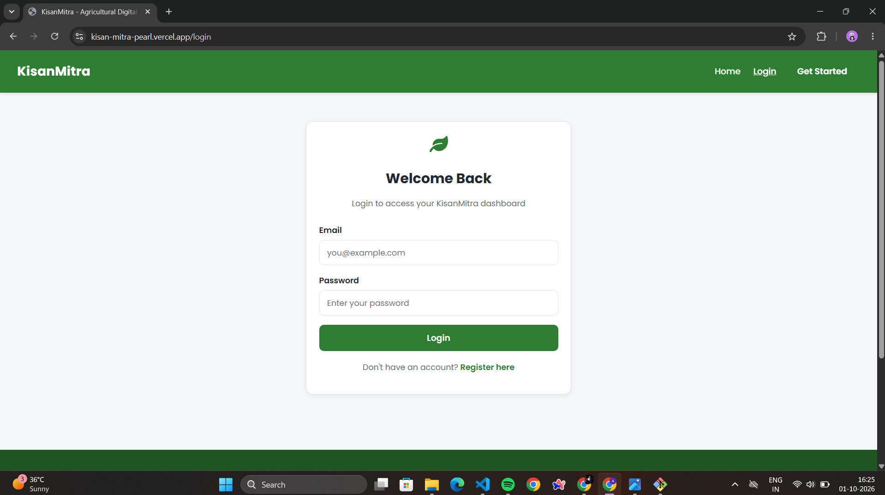
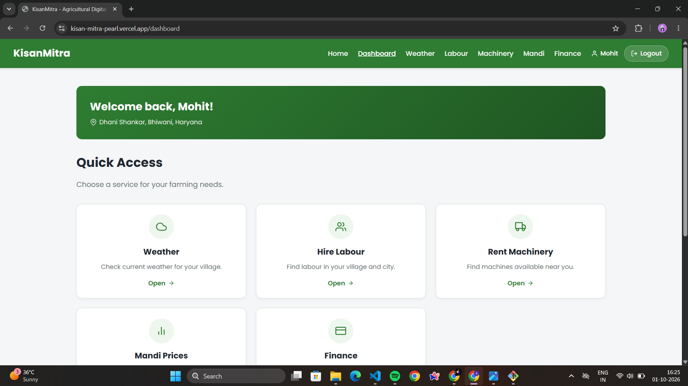
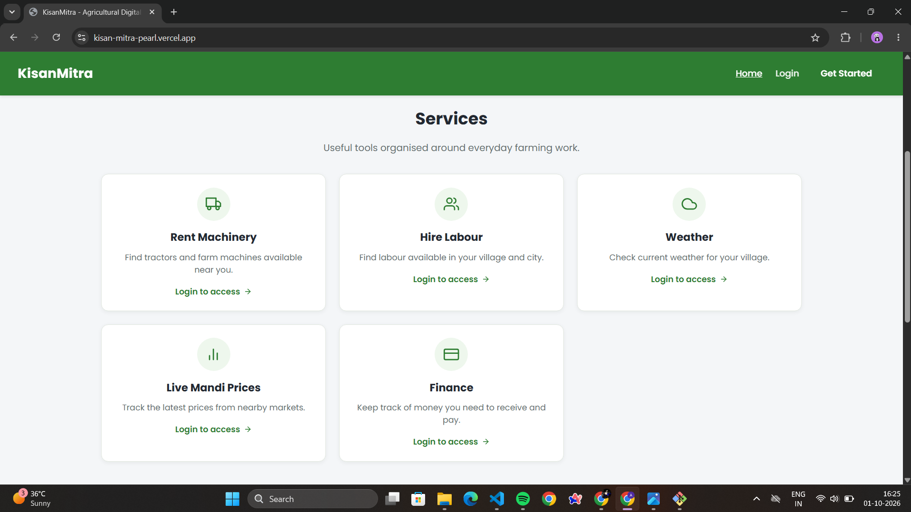
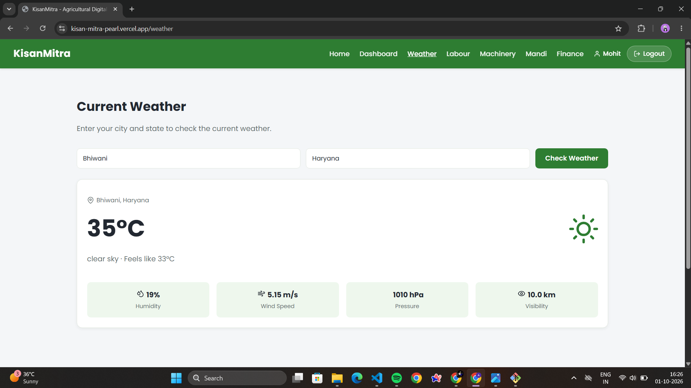
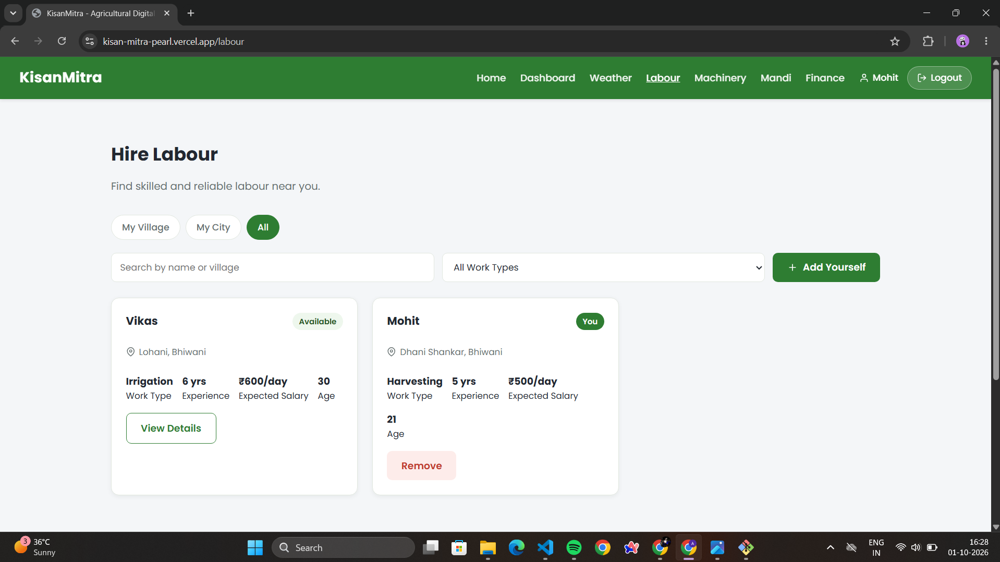
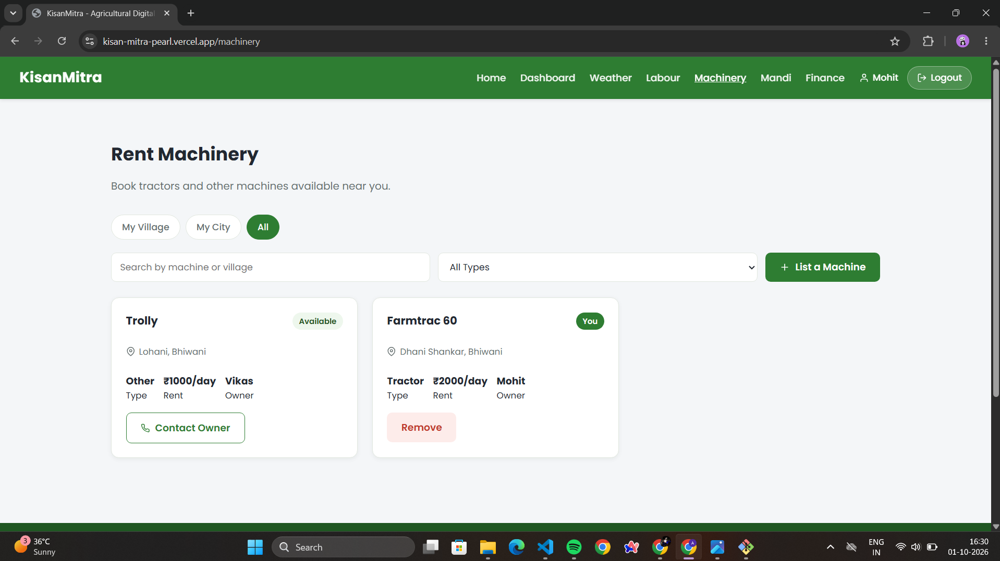
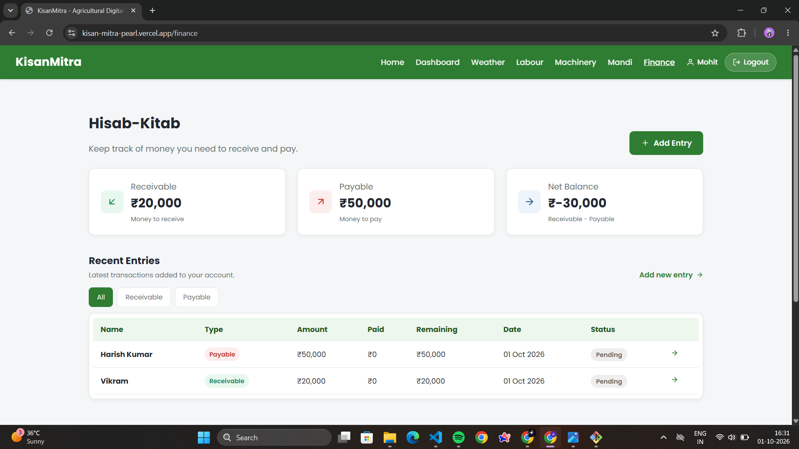
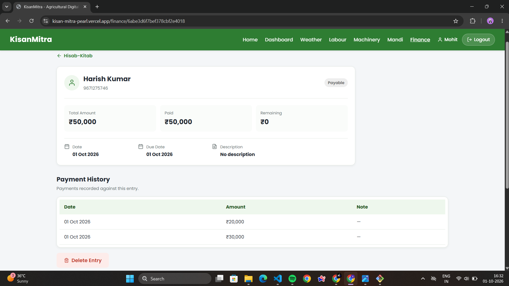

# KisanMitra

**A full-stack digital assistant for farmers — check local weather, track live mandi prices, hire labour, rent machinery, and manage farm finances, all from one simple platform.**

[](https://react.dev/)

[](https://vitejs.dev/)

[](https://nodejs.org/)

[](https://www.mongodb.com/)

[](https://jwt.io/)

[](./LICENSE)


**🔗 Live App:** [kisan-mitra-pearl.vercel.app](https://kisan-mitra-pearl.vercel.app) &nbScreeShots
 **⚙️ API:** [kisanmitra-y5so.onrender.com](https://kisanmitra-y5so.onrender.com/)

---

## Table of Contents

- [Overview](#overview)
- [Screenshots](#screenshots)
- [Key Features](#key-features)
- [Tech Stack](#tech-stack)
- [Project Structure](#project-structure)
- [Getting Started](#getting-started)
- [Environment Variables](#environment-variables)
- [API Reference](#api-reference)
- [Roadmap](#roadmap)
- [Author](#author)
- [License](#license)

---

## Overview

KisanMitra ("farmer's friend") is a MERN-stack platform built to bring everyday farming needs onto one simple screen. Instead of juggling separate apps and phone calls, a farmer can check the current weather for their village, compare live mandi (market) prices pulled from a government data source, find labour or machinery available nearby, and keep track of who owes them money — all from a single, authenticated account.

The project is built as a complete, production-style application: a REST API with authenticated, per-user data access on the backend, live integrations with external weather and market-price APIs, and a fast, responsive single-page app on the frontend — deployed and publicly accessible.

---

## Screenshots


**Login**



**Dashboard**



**Services**



**Weather**




**Hire Labour**



**Rent Machinery**



**Finance Tracker**



**Finance Entry**



---

## Key Features

### 🔐 Authentication & Security
- Secure registration and login with `bcrypt`-hashed passwords
- JWT-based authentication, with the session automatically cleared and the user redirected if a token expires
- Protected routes on both frontend and backend
- Strict per-user data isolation — every record is scoped to its owner

### 🌦️ Weather
- Current weather for the farmer's own village or city, pulled live from OpenWeatherMap
- Temperature, feels-like, humidity, wind speed, pressure, and visibility at a glance

### 📈 Live Mandi Prices
- Real-time commodity prices sourced from the Government of India's data portal
- Filter by state, district, commodity, and market
- Results sorted by the most recent arrival date

### 👥 Hire Labour & 🚜 Rent Machinery
- Browse labour and machinery listings scoped to **My Village**, **My City**, or **All**
- Search by name or village, and filter machinery/labour by type
- List your own labour profile or machine for rent, and remove it whenever you choose
- Clear availability status on every listing (Available / Busy / Rented)

### 💰 Finance Tracker
- Log money you need to **receive** or **pay**, per person, with a due date
- Record partial payments against any entry over time
- Automatic running balance — total receivable, total payable, and net balance
- Each entry's status (Paid / Pending) updates automatically as payments are logged

### 🎨 User Experience
- Clean, responsive UI that works across devices
- Consistent loading, empty, and error states throughout
- Simple two-step onboarding — register with your village, city, and state once, and every feature is automatically scoped to your location

---

## Tech Stack

| Layer | Technologies |
|---|---|
| **Frontend** | React 19, Vite, React Router, React Hook Form, Lucide Icons, React Icons |
| **Backend** | Node.js, Express.js |
| **Database** | MongoDB, Mongoose |
| **Authentication** | JSON Web Tokens (JWT), bcrypt |
| **External APIs** | OpenWeatherMap (weather), data.gov.in (live mandi prices) |
| **Deployment** | Vercel (frontend), Render (backend), MongoDB Atlas (database) |

---

## Project Structure

```
KisanMitra/
├── backend/
│   ├── controllers/          # Business logic for auth, labour, machinery, mandi, weather, finance
│   ├── middleware/           # JWT auth guard
│   ├── models/                # Mongoose schemas — User, Labour, Machinery, FinanceEntry
│   ├── routes/                # Express route definitions
│   ├── server.js              # App entry point
│   └── package.json
│
├── frontend/
│   ├── src/
│   │   ├── components/        # Navbar, Footer, ProtectedRoute, Modal, StatusBox
│   │   ├── pages/              # Route-level views (Home, Dashboard, Weather, Labour, Machinery, Mandi, Finance, Auth...)
│   │   ├── services/
│   │   │   ├── api.js          # Fetch wrapper + token handling
│   │   │   └── auth.js         # Session helpers
│   │   ├── App.jsx             # Route tree
│   │   └── main.jsx            # App entry point
│   ├── index.html
│   └── package.json
│
├── docs/
│   └── screenshots/
├── LICENSE
└── README.md
```

---

## Getting Started

### Prerequisites

- [Node.js](https://nodejs.org/) v18 or higher
- A [MongoDB](https://www.mongodb.com/atlas) database (local instance or Atlas)
- An [OpenWeatherMap](https://openweathermap.org/api) API key
- A [data.gov.in](https://www.data.gov.in/) API key for live mandi prices

### 1. Clone the repository

```bash
git clone https://github.com/ydvmohittt-dev/KisanMitra.git
cd KisanMitra
```

### 2. Set up the backend

```bash
cd backend
npm install
```

Create a `.env` file (see [Environment Variables](#environment-variables)), then run:

```bash
npm run dev
```

The API will be available at `http://localhost:5000`.

### 3. Set up the frontend

```bash
cd frontend
npm install
```

Create a `.env` file (see [Environment Variables](#environment-variables)), then run:

```bash
npm run dev
```

The app will be available at `http://localhost:5173`.

---

## Environment Variables

**`backend/.env`**

```env
PORT=5000
MONGO_URI=your_mongodb_connection_string
JWT_SECRET=your_jwt_secret
OPENWEATHER_API_KEY=your_openweathermap_api_key
DATA_GOV_API_KEY=your_data_gov_in_api_key
```

**`frontend/.env`**

```env
VITE_API_URL=http://localhost:5000/api
```

---

## API Reference

Base URL: `/api` · Routes marked 🔒 require an `Authorization: Bearer <token>` header.

**Authentication**

| Method | Endpoint | Description |
|---|---|---|
| `POST` | `/auth/register` | Register a new account |
| `POST` | `/auth/login` | Log in and receive a JWT |
| `GET` | `/auth/me` 🔒 | Get the currently authenticated user |

**Labour** 🔒

| Method | Endpoint | Description |
|---|---|---|
| `GET` | `/labours?scope=` | List labour — `village`, `city`, or `all` |
| `GET` | `/labours/:id` | Get a single labour profile |
| `POST` | `/labours` | Add your own labour profile |
| `DELETE` | `/labours/:id` | Remove your labour profile |

**Machinery** 🔒

| Method | Endpoint | Description |
|---|---|---|
| `GET` | `/machinery?scope=` | List machinery — `village`, `city`, or `all` |
| `GET` | `/machinery/:id` | Get details of a single machine |
| `POST` | `/machinery` | List a machine for rent |
| `DELETE` | `/machinery/:id` | Remove a machine you listed |

**Weather** 🔒

| Method | Endpoint | Description |
|---|---|---|
| `GET` | `/weather?city=&state=` | Get current weather for a city/state |

**Mandi Prices** 🔒

| Method | Endpoint | Description |
|---|---|---|
| `GET` | `/mandi?state=&district=&commodity=&market=` | Get live commodity prices, with optional filters |

**Finance** 🔒

| Method | Endpoint | Description |
|---|---|---|
| `GET` | `/finance` | List all finance entries, with summary totals |
| `POST` | `/finance` | Add a new receivable/payable entry |
| `GET` | `/finance/:id` | Get a single finance entry |
| `POST` | `/finance/:id/payments` | Log a payment against an entry |
| `DELETE` | `/finance/:id` | Delete a finance entry |

---

## Roadmap

- [ ] SMS/WhatsApp alerts for price changes on followed commodities
- [ ] In-app messaging between farmers for labour/machinery bookings
- [ ] Multi-language support (Hindi and regional languages)
- [ ] Crop advisory recommendations based on weather and season

---

## Author

**Mohit Yadav**
[GitHub](https://github.com/ydvmohittt-dev)

---

## License

This project is licensed under the [MIT License](./LICENSE).
